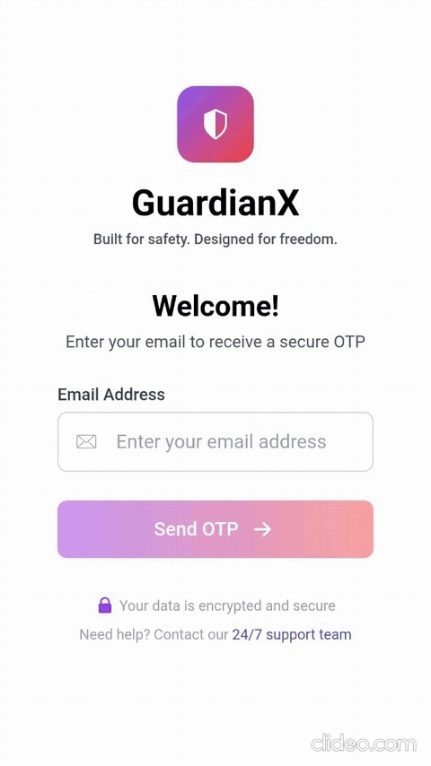

# 🛡️ GuardianX – Safety App Frontend

**Tagline**: *Built for safety. Designed for freedom.*

GuardianX is a real-time personal safety application. This frontend is built using **Next.js**, providing a seamless, responsive, and secure experience across devices. It connects to a serverless backend powered by FastAPI, AWS Lambda, and DynamoDB to deliver real-time SOS tracking, geolocation features, and ally-based alerts.

---

## 🚀 Features

* 🔐 OTP-based authentication
* 🗺️ Google Maps integration for live tracking
* 📍 Location-aware SOS alerts
* 👯 Ally management and mutual linking
* ⚠️ Incident reporting with location tags
* 🎯 Role-based navigation
* 🎨 Clean UI with component-based architecture

---
## 🖼️ Frontend
<p align="center">
  
</p>

---

## 📁 Project Structure

```
src/
├── app/               # Next.js app directory (routing & pages)
├── components/        # Reusable UI components (Map, Cards, AppBar, etc.)
├── services/          # API calls (auth, SOS, maps)
├── context/           # Global state management (auth, SOS state)
├── lib/                # Instances         
```

---

## 🧱 Architecture Overview

* **Frontend**: Next.js (App Router), Tailwind CSS, Zustand (or React Context)
* **Backend**: FastAPI (serverless), deployed on AWS Lambda
* **API Gateway**: Handles secure communication between frontend and backend
* **Authentication**: OTP via email, secured with JWT and refresh tokens
* **Maps**: Google Maps APIs for geolocation, reverse geocoding, and route rendering
* **CI/CD**: Amplify or GitHub Actions +  S3 + CloudFront (optional)

---

## 🛠️ Getting Started

First, install dependencies:

```bash
npm install
# or
yarn install
```

Then, start the development server:

```bash
npm run dev
# or
yarn dev
```

Open your browser at [http://localhost:3000](http://localhost:3000) to view the app.

---

## 🌐 Environment Variables

Create a `.env.local` file with the following variables:

```env
NEXT_PUBLIC_API_BASE_URL=https://your-api-domain.com
```

Ensure your backend and proxy routes are CORS-enabled to accept frontend requests.

---

## 🥩 Integrations

* **Google Maps SDK**: Location selection, reverse geocoding, and direction rendering
* **SMTP/Gmail**: Email-based OTP flow during onboarding
* **API Gateway + Lambda**: All backend services are decoupled and event-driven

---

## 📦 Deployment

The app can be deployed to:

* [Vercel](https://vercel.com/)
* AWS Amplify
* S3 + CloudFront (static export)
* Custom Node.js server (for SSR, if needed)

Static export for S3:

```bash
npm run build
npm run export
```

---

## 📌 TODO (Before Final Release)

* [ ] Integrate WebSocket or polling for real-time SOS tracking
* [ ] Add Lighthouse accessibility and performance tests
* [ ] Final UI polish (responsive behavior, dark mode)

---

## 📚 Learn More

* [Next.js Documentation](https://nextjs.org/docs)
* [Google Maps JavaScript API](https://developers.google.com/maps/documentation/javascript/tutorial)
* [FastAPI](https://fastapi.tiangolo.com/)
* [AWS Lambda + API Gateway](https://docs.aws.amazon.com/lambda/latest/dg/services-apigateway.html)

---

## 🧑‍💻 Authors & Contributors

Built with ❤️ by the Anish Samantaray.
Feel free to contribute or raise issues!
